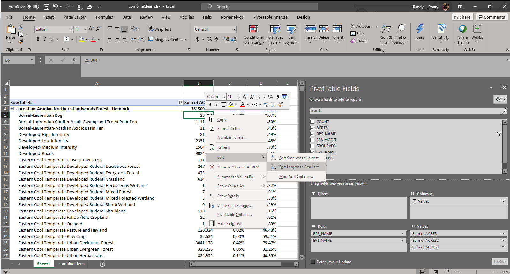
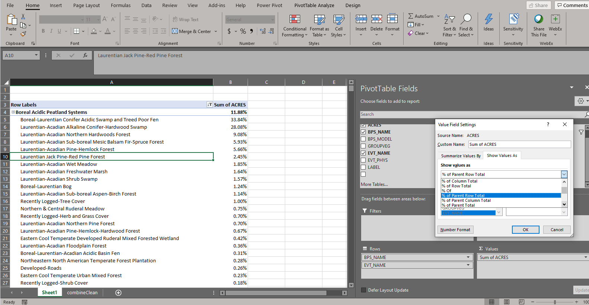

# Exploring conversion {#conversion}

**The main question we explore on this page: how much of the historic ecosystems have been converted to a different land use (e.g., agriculture).  

## The fine print
While this assessment is illustrative, it is important to note that the methods used to create the BpS and EVT datasets are substantially different, and LANDFIRE datasets are not made for assessing small areas.  Please review.  In the exercise we present all possible conversions, some of which may not be meaningful.  We have more confidence in mapped conversion from Northern Hardwoods to Developed-Roads than we would from a Northern Hardwoods to Northern Hardwoods-Hemlock, or even Pine-Hemlock-Hardwood.  Please be circumspect when reviewing results.  We will demonstrate lumping (Group tool in the Pivot Table) similar EVT types here, or you could add value by developing a "Classification of Change" that might include "Not meaningful", "Meaningful" and "Check in field" categories.  


## Pivot table work
Working in the "Conversion" worksheet:

1. Check the box next to "EVT_NAME" in the Pivot Table Fields pane.  Make sure that everything is arranged as in the screenshot below (e.g., "BPS_NAME" is on top of "EVT_NAME" in the "Rows" pane).  Note-I am about to sort in descending order.

<br>

```{r, echo=FALSE, out.width='100%'} 


```

<br>

2. Review the results. In the example above we can see that what LANDFIRE mapped as Laurentian-Acadian Forest-Hemlock in the BpS data set has been split into many Existing Vegetation Types.  If ordered we get a little more information, but the numbers are misleading.  We'd like to see how much of what was Ecosystem X is still Ecosystem X, and how much is now Ecosystem Y, and so on, but the numbers are looking across the whole landscape.  They need to be recalculated so we get the percentage of EVT per BpS.
3. To reconfigure the Pivot Table:
    * Drag the "Sum of ACRES2" and "Sum of ACRES3" field from the "Values" pane up to the Pivot Table Fields to remove it.
    * Click the "Sum of ACRES" item in the "Values" pane to access the Value field settings.
    * Click on the "Show Values As" tab, then select "% of Parent Row Total" in the "Show Values As" drop down.  
    
Here's a screenshot of making that selection:

<br>

```{r, echo=FALSE, out.width='100%'} 


```

<br>


Scroll through the table below to explore the resulting data.  The table has been exported from the Pivot Table and cleaned up a bit for viewing.  


**Example output**

Below is essentially the output from our Pivot Table work with a few changes:

* Names have been shortened for ease of reading
* Numbers have been rounded
* We filtered for the top 10 most widespreat Biophysical Settings

<br>

```{r bpsEvtDT, echo=FALSE, message=FALSE, warning=FALSE}
library(DT)
library(readr)
bpsEvt <- read_csv("bpsEvt.csv")


datatable((bpsEvt), 
          class = 'cell-border stripe',
          options = list(scrollX  = TRUE, 
                         pageLength = 5, scrollY = "400px")) %>%
  formatRound("Percent", 0)
```

<br>
<br>

Looking at the Laurentian-Acadian Northern Hardwoods Forest - Hemlock for our landscape we note a few things:

* Most of what was mapped as this type historically in the BpS dataset is still mapped as that type
* Cumulatively about 6% of this type is now roads and recently logged types.
* The other EVTs mapped are not terribly "off-site" (e.g., something like "Plantation").  


As noted above without a fair amount of knowledge of the landscape and review of the input datasets this sort of comparison should be viewed with skepticism.  Below we will do some grouping to make the comparison more broad, and probably accurate.

## Grouping
1. We will start by reformatting the Pivot Table a bit.  
    * Remove both "Sum of ACRES" columns by dragging them up to the PivotTable Fields pane.
    * Remove the "BPS_NAME" column by unchecking it in the "Rows" field. 
    * Click within the Pivot Table -> Design tab -> Subtotals -> Do not show subtotals.
    * Design tab -> Grand Totals -> "Off for rows and columns.
    * Design tab -> Report Layout -> "Show in tabular form" and "Repeat all line items"
2. To assist in grouping, add in the "EVT_PHYS" column by checking it in the PivotTable Fields pane.  Insure it is listed on top of "EVT_NAME" in the Rows pane.  If not drag it to the top.
3. In the "EVT_NAME" column, hold your Shift key while selecting all of the EVT_NAME types within the Agricultural EVT_PHYS column -> right click the highlighted types -> select "Group".  This will create a new field called "EVT_NAME2" and a grouped type auot-named "Group1".  You can rename this by clicking in any of the "Group 1" cells and typing something such as "Agriculture". 
4. Take the same approach as in # 3 to group the EVTs that begin with or include the word "Developed" *except* you will be working in the "EVT_NAME2" field now.
5. Now that we have done some grouping let's clean this table up and bring in the "BPS_NAME" column.  Drag "EVT_NAME" and "EVT_PHYS" from the Rows field to the PivotTable Fields pane, or uncheck them in the PivotTable Fields pane.   Add in the "BPS_NAME" field by checking it in the PivotTable Fields pane. Drag the "BPS_NAME" field to the top of the rows pane if it is not already there.
6. Add the "Sum of ACRES" field, sort descending and change the value field settings to show "% of Parent Row Total". Remember how to do all of that?
  

Note-another approach would be to simply use the "EVT_PHYS" column.  Since we wanted to retain some EVTs we did not use this approach here. Further in the interest of time we did not do a complete Grouping.  


## Visual exploration for fun. 

Sometimes patterns emerge from visuals.  Below is a [Sankey Diagram](https://en.wikipedia.org/wiki/Sankey_diagram) generated in R (can also be created in Excel we hear.  See instructions [here](https://mychartguide.com/how-to-draw-sankey-diagram-in-excel/)).  On the left are the historical ecosystems, on the right current ecosystems and flow bands.  The width of the bands is proportional to the flow rate.  Some potential interpretations, partially based on the chart, partially based on local knowledge:

* There is more northern hardwoods mapped today than historically.  This could be due to "simplification" of ecosystems that have some shared species.  For example, many conifers have been removed and deer present a challenge for regeneration.  One hypothesis would be that due to logging and deer the "Pine-Hemlock-Hardwood-Forest" has been essentially converted to "Northern Hardwoods".
* It might be more illuminating to group some types together, such as the "Recently Logged" types.
* LANDFIRE has mapped potential change of the wetlands to other types.  This could be due to mapping errors, or due to alterations in hydrology because of roads perhaps.  More investigation is warranted.

[Download Sankey Diagram]()

```{r sankey, echo=FALSE, message=FALSE, warning=FALSE, fig.width=10, fig.height=8}

library(networkD3)
library(dplyr)
library(readr)
library(dplyr)

data <- read_csv("bps2evt.csv")

nodes <- data.frame(
  name=c(as.character(data$source), 
         as.character(data$target)) %>% unique())


data$IDsource <- match(data$source, nodes$name)-1 
data$IDtarget <- match(data$target, nodes$name)-1

# Make the Network
snky2 <- sankeyNetwork(Links = data, 
                       Nodes = nodes,
                       Source = "IDsource", 
                       Target = "IDtarget",
                       Value = "value", 
                       NodeID = "name", 
                       fontSize=14,
                       iterations = 0,
                       sinksRight=FALSE)

snky2

# save the widget
library(htmlwidgets)
saveWidget(snky2, "sankey.html")


```

