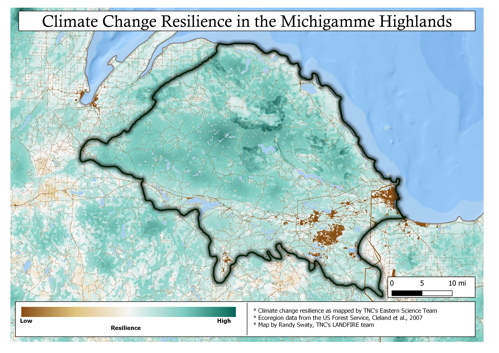

--- 
title: "Using LANDFIRE Products to explore historical and current ecosystems"
author: "Draft by Randy Swaty, Keith Phelps and Stacey Marion"
date: "`r Sys.Date()`"
site: bookdown::bookdown_site
documentclass: book
---

# Introduction

Placeholder


## Download this!
## About this document

<!--chapter:end:index.Rmd-->

---
title: "Ataya Introduction"
output: html_document
---

**The Ataya Forest Tract**

Our example landscape is TNC's "Ataya" tract, an approximately 100,688-acre forested landscape in southeastern Kentucky and northeastern Tennessee. The Ataya is located in the Central Appalachians, and is situated in the historic homelands of the S'atsoyaha (Yuchi), Shawandasse Tula (Shawnee), and the Tsalaguwetiyi (Cherokee, East) nations. The nearest largest metropolitan area to Ataya is Knoxville, TN (population 186,173). According to LANDFIRE's Biophysical Settings (BpS), the top three (3) historically dominant forest ecosystem types in Ataya were: Southern Appalachian Oak Forest, South-Central Interior Mesophytic Forest, and Southern Appalachian Cove Forest. Historically in Southern Appalachian Oak Forests, low severity surface fires with fire intervals of 7-26 years were the dominant ecosystem disturbance. Other important historic disturbances in the forests of the Ataya included insect outbreaks, ice storms, windthrow, and drought. 

The forests in the Central Appalachians experienced considerable alteration with European colonization and land use changes. Important land use and ecological changes included extensive clear-cut logging in the early 20th century, coal mining, the functional extinction of the American Chestnut (**Castanea dentata**) and fire-suppression policies enacted in the early 20th century. Currently, the Central Appalachians are facing population reductions in fire tolerant/shade intolerant species such as oaks and shortleaf pine (**Pinus echinata**), drastic declines of eastern hemlock (**Tsuga canadensis**) with the introduction of Hemlock Wooly Adelgid, and various invasive plant (i.e. kudzu, autumn olive, Japanese stilt grass) threats.  

The Ataya is of conservation interest due to the relatively high connectivity, large average land parcel size and projected climate change resiliency.

```{r AtayaFigure, echo=TRUE, out.width=100}
knitr::include_graphics("KP_GISmaps/Ataya_studyfig.png")

```

<!--chapter:end:01-AtayaIntro.Rmd-->

# Our example landscape {#exampleIntro}

**The Michigamme Highlands**

Our example landscape is in the north central region of the Upper Peninsula of Michigan (a mouthful, eh?).  The largest nearby city is Marquette, MI, population 20,822 (2019).  This ecoregion is ~757,000 acres (306380 hectares) and is know for its beautiful forests, rivers and lakes.  It is underlain by sandstone, slate, shale and iron formations.  Elevations range from around 600ft to almost 2,000 ft above sea level.  The ecoregion  has a humid continental climate with a growing season ranging from 75-150 days and average annual snowfall amounts reaching 200 inches in the higher terrain.

Logging and mining have been the major industrial forces in the area.  Both continue today, especially logging.  Mining has transitioned from largely iron to primarily nickel.  

The area is of conservation interest due to the relatively high connectivity, large average land parcel size and projected climate change resiliency (see map below).

**The Ataya Forest Tract**

Our example landscape is TNC's "Ataya" tract, an approximately 100,688-acre forested landscape in southeastern Kentucky and northeastern Tennessee. The Ataya is located in the Central Appalachians, and is situated in the historic homelands of the S'atsoyaha (Yuchi), Shawandasse Tula (Shawnee), and the Tsalaguwetiyi (Cherokee, East) nations. The nearest largest metropolitan area to Ataya is Knoxville, TN (population 186,173). According to LANDFIRE's Biophysical Settings (BpS), the historically dominant forest ecosystem types consisted of Southern Appalachian Oak Forest, South-Central Interior Mesophytic Forest, and Southern Appalachian Cove Forest. Historically in Southern Appalachian Oak Forests, low severity surface fires with fire intervals of 7-26 years were a dominant ecosystem disturbance. Other important disturbances in the forests of the Ataya include insect outbreaks, ice storms, windthrow, and drought. 

The forests in the Central Appalachians experienced considerable alteration with European colonization and land use changes. Important land use and ecological changes included extensive clear-cut logging in the early 20th century, coal mining, the functional extinction of the American Chestnut (**Castanea dentata**) and fire-suppression policies enacted in the early 20th century. Currently, the Central Appalachians are facing population reductions in fire tolerant/shade intolerant species such as oaks and shortleaf pine (**Pinus echinata**), drastic declines of eastern hemlock (**Tsuga canadensis**) with the introduction of Hemlock Wooly Adgelgid, and various invasive plant (i.e. kudzu, autumn olive, Japanese stilt grass) species threats.  

The Ataya is of conservation interest due to the relatively high connectivity, large average land parcel size and projected climate change resiliency.

```{r michiResilient, echo=TRUE, out.width=}


```

<!--chapter:end:01-exampleIntro.Rmd-->


# GIS Analysis Requirements, Methods, and Disclaimers... oh my!  {#ourmethods}

Placeholder


## GIS Analysis Requirements 
## Methods 
## Disclaimers 
## Lastly... Download this!
## About this document

<!--chapter:end:02-OurMethods.Rmd-->

# LANDFIRE Data for landscape assessment {#inputData}

## LANDFIRE for landscape ecosystem assessment  Test

There are some basic steps in assessing the ecological situation of your landscape, including:

* mapping historical and current ecosystems, and the difference between the two; and further looking at representation  of ecosystems inside and outside of your landscape of interest.
* assessing succession classes (aka seral states) of these ecosystems, past and present

These steps, while foundational and conceptually simple, can be difficult due to a lack of data, especially when doing them at a landscape scale which often means looking across multiple land ownerships.  


## The LANDFIRE datasets we used for this guide

* Spatial datasets, clipped to your area(s) of interest
    * [Biophysical Settings (BpS)](https://www.landfire.gov/bps.php).  This dataset will be used to get at "community habitat", or where ecosystems could occur based on abiotic factors (e.g., soils, climate and natural disturbance regimes).
    * [Succession classes](https://www.landfire.gov/sclass.php) characterize structural classes on the landscape at the time the dataset represents (e.g., 2016 for LF Version 200).
    * [Existing Vegetation Type](https://www.landfire.gov/evt.php) maps NatureServe's Ecological Systems (see descriptions [here](https://www.landfire.gov/documents/LANDFIRE_Ecological_Systems_Descriptions_CONUS.pdf)).
* Non-spatial products
    * [Biophysical Settings Descriptions](http://landfirereview.org/test/search.php) which has information on natural disturbance regimes and succession class descriptions (also available [here](https://www.landfire.gov/zip/LANDFIRE_CONUS_SClass_Mapping_Rules_9182020.zip)).  
    * [Reference Condition Table](https://www.landfire.gov/zip/LANDFIRE_CONUS_Reference_Condition_Table_August_2020.zip) supplements the BpS descriptions with the "reference" percentages for each succession class, for each Biophysical Settings.
    
## Guidance on obtaining LANDFIRE products

There are multiple ways to get LANDFIRE products depending on whether you are looking to obtain BpS models and descriptions or the spatial data:

* For BpS models and descriptions go to: http://landfirereview.org/search.php.  Start by clicking on the "View map of LANDFIRE Map Zones".  This will help you narrow down your search.  Alternatively, you can wait to download BpS descriptions until you do some GIS work and get specific names of BpSs of interest.
* For the spatial datasets you can explore options [here](https://www.landfire.gov/getdata.php) which include:
    * Downloading [Full Extent Mosaics](https://www.landfire.gov/version_comparison.php).  When you do use this option you get large files that cover the entire lower 48, AK or HI (depending on your selection).  We use this method when we have several landscapes and/or a large area and no computer storage issues.
    * Using the [LANDFIRE Data Distribution Site](https://www.landfire.gov/viewer/).  With this method you essentially select the datasets you need then draw a rectangle (or you can select state or counties) around your area of interest to start the downloader.  We recommend this if your area of interest is not too large and/or you have a low number of landscapes and/or have storage limits.

<!--chapter:end:03-inputData.Rmd-->


# Historical Ecosystems {#historicalEcosystems}

Placeholder


## General methods
### A few potential traps with Pivot Tables
## Getting at amounts of historical ecosystems

<!--chapter:end:04-historicalEcosystems.Rmd-->


# Existing Vegetation Types {#evt}

Placeholder


## General methods
## Getting at amounts of current ecosystems

<!--chapter:end:05-evt.Rmd-->


# Exploring conversion {#conversion}

Placeholder


## The fine print
## Pivot table work
## Visual exploration for fun. 

<!--chapter:end:06-conversion.Rmd-->


# Succession Classes {#successionClasses}

Placeholder


## What we will do here
## What are "Succession Classes?"
## Our sample ecosystem
## Your tasks
### Current succession classes
###  Historical succession classes

<!--chapter:end:07-successionClasses.Rmd-->


# APPENDIX {#gisPrep}

Placeholder


## GIS Prep: Combine data
## GIS Prep: Join in attributes
## GIS Prep:Clean data table

<!--chapter:end:gisPrep.Rmd-->

