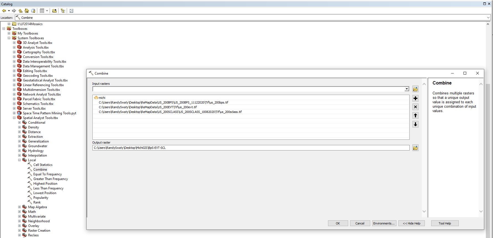

--- 
title: "Using LANDFIRE Products to explore historical and current ecosystems"
author: "Draft by Randy Swaty, Keith Phelps and Stacey Marion"
date: "`r Sys.Date()`"
site: bookdown::bookdown_site
documentclass: book


---

# Introduction
The [Forest Stewardship Council](https://fsc.org/en) develops and delivers Principles, Criteria and Indicators for sustainable forest management (need link to correct standard).   Principles 6 and 9  are focused on Environmental Impact and Maintenance of High Conservation Value Areas respectfully.  Many of the criteria and indicators within those principles require a GIS assessment of historical and current vegetation conditions, disturbance regimes and landscape patterns

[LANDFIRE](https://landfire.gov/) is an interagency program within the United States that "provides 20+ national geo-spatial layers (e.g. vegetation, fuel, disturbance, etc.), databases, and ecological models that are available to the public for the US and insular areas."  With this data it is possible to fulfill the requirements of several indicators within Principles 6 and 9.  Here we provide guidance for:

* downloading relevant LANDFIRE datasets and models
* completing the GIS processing of LANDFIRE data
* developing visuals (e.g., maps and charts) to help illustrate findings


In general the analyses developed here will help managers:

* quantify ecosystems past and present
* explore ecosystem conversion (both to unnatural (e.g., urban) land uses and different ecosystems)
* compare amounts of succession classes past and present
* document types and amounts of historical disturbances


In the United States, including the insular areas, [LANDFIRE](https://www.landfire.gov/) provides the datasets and ecological model results to get at these challenges and more.  Here we walk you through some of the technical steps needed to start your analysis.  We will do our work in a model landscape, the Michigamme Highlands in the Upper Peninsula of Michigan (highlighted in green in map below).

To help you with the concepts we work through pre-processed LANDFIRE data for an example landscape.  To prepare the datasets for your landscape see the Appendix.


**ZOOM, pan, explore the Michigamme Highlands area**
```{r loadshp, message=FALSE, warning=FALSE, include=FALSE}
library(raster)
library(leaflet)
library(sf)

michi <- st_read("mhData/michishp.shp")
michi <- st_transform(michi, CRS("+proj=longlat +datum=WGS84 +ellps=WGS84 +towgs84=0,0,0"))

```


```{r leafletMichi, echo=FALSE, message=FALSE, warning=FALSE}

leaflet(data = michi) %>% 
  addTiles() %>% 
  addPolygons(fill = FALSE, stroke = TRUE, color = "#193b22")

```

```{r echo=FALSE, message=FALSE, warning=FALSE}

### EXAMPLE


```

## Download this!
To work through this guide you will need to download this [zipped folder](https://github.com/rswaty/landfireFSC/blob/main/toDownload.zip) by clicking the hyperlinked text, then the "Download" button that will be on the right side of the screen.  This folder contains:

* An Excel file
* One ecosystem description
* An ArcMap map package file in case you want to explore in ArcMap.

## About this document

It was written in R using [R-Studio](https://rstudio.com/), the ["bookdown" package](https://www.bookdown.org/) and is hosted on [GitHub(links to this repository)](https://github.com/rswaty/landfireFSC).  


