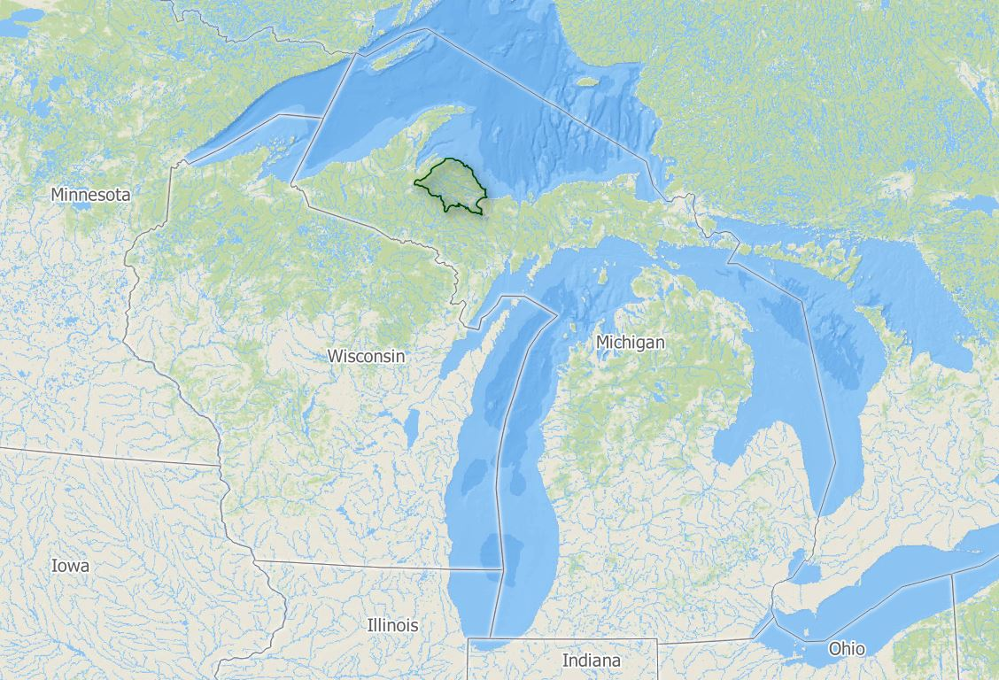

--- 
title: "Using LANDFIRE Products to explore historical and current ecosystems"
author: "The Nature Conservancy's LANDFIRE team"
date: "`r Sys.Date()`"
site: bookdown::bookdown_site
documentclass: book

---

# LANDFIRE for landscape ecosystem assessment

There are some basic steps in assessing the ecological situation of your landscape, including:

* mapping historical and current ecosystems, and the difference between the two; and further looking at representation  of ecosystems inside and outside of your landscape of interest.
* assessing succession classes (aka seral states) of these ecosystems, past and present
* understanding natural disturbance regimes

These steps, while foundational and conceptually simple can be difficult due to a lack of data, especially when doing then at a landscape scale which often means looking across multiple land ownerships.  

<div style="float:right">
```{r, echo=FALSE, fig.width=2} 


```
</div>

In the United States, including the insular areas [LANDFIRE](www.landfire.gov) provides the datasets and ecological model results to get at these challenges and more.  Here we walk you through some of the technical steps needed to start your analysis.  We will do our work in a model landscape, the Michigamme Highlands in the Upper Peninsula of Michigan (highlighted in green in map).

This is a technical guide-we will provide links for you to learn about the datasets and other inputs.  


